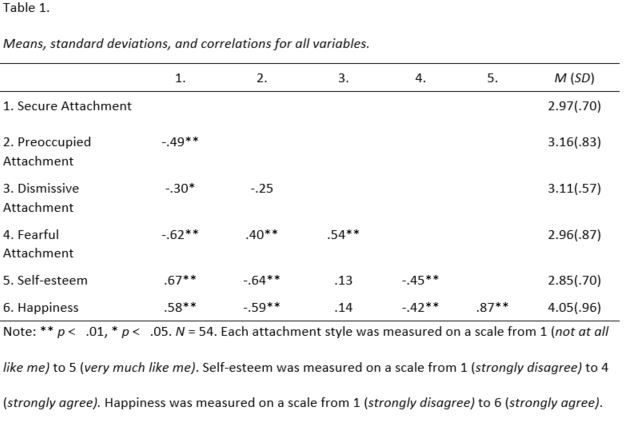

# A-Study-on-Happiness
This is a repo for my independent research study on the relationship between happiness, adult attachment, and self-esteem

## Abstract

At present, psychological research on happiness is extensive and vast. Throughout history, scholars have argued overt the definition of happiness and how to achieve it, however,  the recent field of evolutionary psychology argues that the human species, along with other primates and much of the animal kingdom, is ‘hard-wired’ to draw happiness from close contact with others. Humans are social creatures. The interpersonal dynamics of close relationships have been empirically studied within the field of social and personality psychology since the beginning of the 20th century. However, minimal research has been done on the role of attachment styles on happiness. The purpose of the present research was to investigate whether adulthood attachment style is related to overall, global levels of happiness. This study proposed that both a secure attachment style and dismissive attachment style will lead to higher levels of happiness; and that both a preoccupied attachment style and fearful attachment style will lead to lower levels of happiness; and that these relationships will be mediated by self-esteem. Sixty two students from the University of North Carolina at Charlotte participated in an online survey assessing adulthood attachment, self-esteem, and happiness. Results were consistent with three of the four proposed hypotheses. Those who scored higher on secure attachment also scored higher on self-esteem and happiness. Those who scored higher on preoccupied and fearful attachment also scored lower on self-esteem and happiness. Dismissive attachment was not related to either self-esteem or happiness. Implications and future research are provided. 

## Results

## Resources

